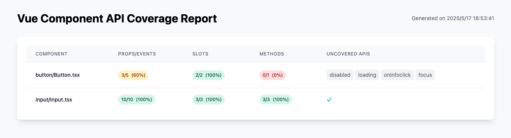

# vc-api-coverage
A Vue Component API Coverage Tool.

A specialized Vitest reporter designed for Vue 3 TSX components that helps you track and improve your component API coverage. This tool analyzes and reports the usage coverage of your component's Props, Events, Slots, and Exposed methods in your tests.

## Features

- 📊 Detailed coverage reporting for Vue 3 TSX components
- ✨ Tracks Props, Events, Slots, and Methods Coverage
- 🎯 Visual representation of test coverage with emoji indicators
- 🔍 Clear identification of untested component APIs
- 📈 Coverage percentage calculation for each API category

## Installation

```bash
npm install vc-api-coverage --save-dev
# or
yarn add -D vc-api-coverage
# or
pnpm add -D vc-api-coverage
```

## Usage

1. Add the reporter to your Vitest configuration:

```ts
// vitest.config.ts
import { defineConfig } from 'vitest/config'

export default defineConfig({
  test: {
    reporters: ['vc-api-coverage']
  }
})
```

2. Run your tests as usual:

```bash
vitest
```

The reporter will automatically generate coverage reports for your Vue 3 TSX components, showing which APIs are covered by your tests and which ones need attention.

## Configuration

The reporter supports several configuration options to customize its behavior:

```ts
// vitest.config.ts
import { defineConfig } from 'vitest/config'

export default defineConfig({
  test: {
    reporters: [['vc-api-coverage', {
      // File patterns to include in the coverage report
      include: ['src/**/*.vue', 'src/**/*.tsx', 'src/**/*.ts'],
      
      // Output directory for the coverage report
      outputDir: 'coverage',
      
      // Report formats: 'cli', 'html', 'json'
      // You can specify multiple formats: ['cli', 'html']
      format: ['cli', 'html', 'json'],
      
      // Whether to open browser after generating HTML report
      openBrowser: false
    }]]
  }
})
```

## Example Output

### 1. CLI Format
```
------------------|---------|----------|---------|-----------|-------------------------------
Components        |   Props |  Emits   | Slots   |  Exposes  | Uncovered API
All               |   80%   |   83%    |   100%  |   0%      |
Button.tsx        |   2/4   |   1/2    |   2/2   |   0/1     | loading, disabled, hover, focus
Input.tsx         |   6/6   |   4/4    |   3/3   |   0/3     | focus, select, clear
------------------|---------|----------|---------|-----------|-------------------------------
```

### 2. HTML Format



### 3. JSON Format
```json
{
  "summary": {
    "totalComponents": 1,
    "totalProps": 10,
    "coveredProps": 8,
    "totalEmits": 6,
    "coveredEmits": 5,
    "totalSlots": 5,
    "coveredSlots": 5,
    "totalExposes": 4,
    "coveredExposes": 0
  },
  "stats": {
    "props": 80,
    "events": 83,
    "slots": 100,
    "methods": 0,
    "total": 72
  },
  "components": [
    {
      "name": "Button.tsx",
      "file": "src/components/button/Button.tsx",
      "props": {
        "total": 4,
        "covered": 2,
        "details": [
          {
            "name": "loading",
            "covered": false
          },
        ]
      },
      "emits": {
        "total": 2,
        "covered": 1,
        "details": [
          {
            "name": "click",
            "covered": true
          },
        ]
      },
      "slots": {
        "total": 2,
        "covered": 2,
        "details": [
          {
            "name": "default",
            "covered": true
          },
        ]
      },
      "exposes": {
        "total": 1,
        "covered": 0,
        "details": [
          {
            "name": "focus",
            "covered": false
          }
        ]
      }
    },
  ]
}
```

## Contributing

Contributions are welcome! Please feel free to submit a Pull Request.

## License

MIT
